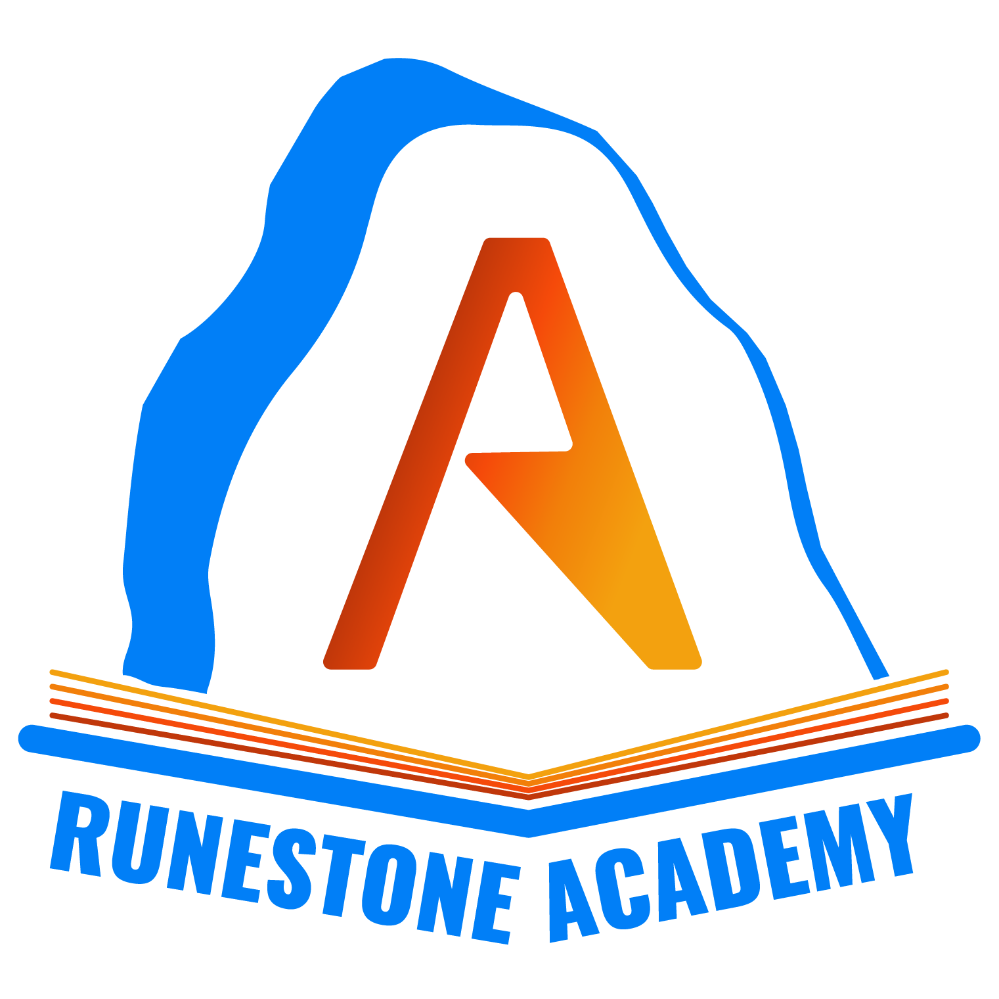

..  Copyright (C)  Brad Miller, David Ranum
    Permission is granted to copy, distribute and/or modify this document
    under the terms of the GNU Free Documentation License, Version 1.3 or
    any later version published by the Free Software Foundation; with
    Invariant Sections being Forward, Prefaces, and Contributor List,
    no Front-Cover Texts, and no Back-Cover Texts.  A copy of the license
    is included in the section entitled "GNU Free Documentation License".

=============================
Overview of Runestone Academy
=============================

..  shortname:: Overview
..  description:: This is an overview chapter for the web site.

.. admonition:: **Runestone Academy** is a project that provides:

    * Interactive, open source textbooks for computer science, math and other topics
    * Integrated LMS to give instructors insight into their students performance
    * Tools for writing your own interactive activities (or even your own book!)
    * An application server for hosting your own content on the web.  We also use this server to provide textbooks as a service!

In order to see how the special tools for writing interactive activities work, and examine the type of special content that's used in our interactive textbooks, the following sections will show a few of them in action. For more detailed documentation and information about the Runestone community and project, please see `the main Runestone Interactive website <https://runestoneinteractive.org>`_.  To use Runestone in your own classroom go to `Runestone Academy <https://runestone.academy>`_ and create your own course.

Table of Contents
=================

.. toctree::
    :numbered:
    :maxdepth: 3

    ActiveCode/toctree
    Assessments/toctree
    Visualizers/toctree
    Containers/toctree
    Video/toctree
    Misc/toctree
    OtherMarkups/toctree
    CellBotics/toctree

How can I use Runestone?
========================

There are several ways that you might want to use Runestone in your own classroom.  The most common way is to choose one of our textbooks, and allow us to serve that book to your students.  We call this building a custom course.  Hundreds of high schools and colleges use our service to provide their students great content for learning computer science. Its free, and you don't have to install any additional software on your school computers to get going.  In the sections below you will see examples of the kinds of interactive components that are embedded in our textbooks, that enhance the learning of your students.

If you decide to use one of our books, you can customize the book in a couple of different ways.

* You can create your own assignments, by combining end of the chapter exercises or review questions that are right in each section of the book.  We have a grading interface that allows you to grade these assignments and provide students feedback, all within the textbook.

* You can also customize which chapters you want to use, and the order that you teach them in.  That takes a bit more work, but you can definitely do it.

Once you get going using one of our textbooks, you may decide that you want to create your own tutorials, lab exercises, or even make a short booklet to use as presentation materials.  Using the runestone tools it is pretty easy to make your own materials. We have `Documentation on how to do that <https://runestone.academy/runestone/books/published/instructorguide/WritingExercises/toctree.html>`_

What is an Interactive Textbook?
================================

One of the key differences between an interactive textbook and a regular textbook is that with an interactive textbook your students do not need to switch back and forth between reading a book and interacting with a development environment.  One of our primary motivations for creating an interactive book was to encourage students to experiment with examples as they are reading.  To do this we developed the idea of an activecode example.  This led to the development of many other interactive components.  In the following sections you can explore each of them from the perspective of a reader.
